# Dragonswap Token Release Kit scripts

## 🎯 System Overview

**Initial tokens** → **Airdrop contract** (time-locked release) → **Staker contract** (earning generation)

Users can claim airdropped tokens either directly to their wallet (with penalty) or stake them immediately (penalty-free) to start earning rewards.

---
> [!TIP]
> Please take your time to read through the usage of the scripts before deploying to a production environment


***

## Deployment configuration

> [!NOTE]
> Below is `script/config/deploy-config.json`
> From now-on we will be calling it `deploy-config.json`


This JSON formatted file is the primary configuration point for the deploy scripts.
```
{
  "airdrop": {
    "owner": "0x1AFb6347B42aDc71D8C02DC43a3307f46E7F061D",
    "treasury": "0x1AFb6347B42aDc71D8C02DC43a3307f46E7F061D",
    "signer": "0x1AFb6347B42aDc71D8C02DC43a3307f46E7F061D",
    "token": "0xC850Ad7Bd0cc903a2B470Af6eFA7d1043571C095",
    "unlockTimestamps": [1754006400, 1756684800]
  },
  "factory": {
    "owner": "0x1AFb6347B42aDc71D8C02DC43a3307f46E7F061D"
  },
  "staker": {
    "owner": "0x1AFb6347B42aDc71D8C02DC43a3307f46E7F061D",
    "stakingToken": "0xC850Ad7Bd0cc903a2B470Af6eFA7d1043571C095",
    "treasury": "0x1AFb6347B42aDc71D8C02DC43a3307f46E7F061D",
    "fee": 1000,
    "rewardTokens": ["0xC850Ad7Bd0cc903a2B470Af6eFA7d1043571C095"]
  }
}
```


> [!NOTE] 
> Below is `script/config/deployed-addresses.json`
> From now-on we will be calling it `deployed-addresses.json`

After each deploy, the `deployed-addresses.json` is populated with the newly acquired deployed addresses.
```
{
"airdrop":"0x7fdB7a34D3fcb8d28942178A07F2E5c4A37720F9",
"airdropImpl":"0x48dDe5adbCd8FF6cd79b9A633042Ea97794e486f",
"factory":"0x283120f98dEa005F0cD443b3E301795F93f0f3f1",
"staker":"0x65a9F7F52400645cA4611267cfbCCD9A6bDb950F"
}
```

***

## Deploying the staker

> [!TIP] 
> Below is the code that explains the way that fee parameter for the staker is used in calculating fees.
> Please do your dilligence and study it thorougly.


```solidity
uint256 private constant feePrecision = 1_00_00;
uint256 feeAmount;
if (_stake.unlockTimestamp == 0) {
    feeAmount = amount * fee / feePrecision;
    amount -= feeAmount;
    stakingToken.safeTransfer(treasury, feeAmount);
}
```


***

## Installing project dependencies
TODO

***

## Using the scripts
> [!TIP] 
> You may use the scripts for ease of deployment. The environment variables the scripts use from .env are
> 
> DEFAULT_RPC_URL
>
> DEFAULT_SENDER
>
> DEFAULT_PRIVATE_KEY

Currently, 2 bash scripts are available in the project root.
* deploy.sh
* checksum.sh

Please use them in this particular order.
You may append the --help flag for more information.
***


## 📊 User journey map

1. **Airdrop Claim**: User signs transaction to claim unlocked portions
2. **Choice Point**: 
   - **2.A**: Direct withdrawal (pays penalty)
   - **2.B**: Auto-stake (no penalty, starts earning)
3. **Staking Phase**: Locked stakes earn rewards for 30 days
4. **Harvest**: Claim accumulated rewards while maintaining stakes
5. **Exit**: Withdraw principal + any unclaimed rewards

---


# Smart Contract System Architecture

## System Overview Diagram

```mermaid
graph TB
    %% External Entities
    Owner["👤 Owner/Admin"]
    User["👤 User"]
    Treasury["🏦 Treasury"]
    Signer["🔐 Signer"]
    
    %% Core Contracts
    Factory["📦 AirdropFactory<br/>Creates clones via minimal proxy<br/>Tracks all deployments<br/>Owner-controlled"]
    
    Implementation["🎯 Airdrop Implementation<br/>An optimization technique to save gas when deploying multiple airdrops."]
    
    AirdropInstance1["💧 Airdrop Instance 1<br/>Time-locked distributions<br/>Signature verification<br/>Penalty system"]
    
    AirdropInstance2["💧 Airdrop Instance 2<br/>Independent configuration<br/>Own unlock schedule<br/>Own treasury/signer"]
    
    Staker["🥩 Staker Contract<br/> This contract allows you to lock tokens for 30d,</br>and then get just the earnings and keep staking.</br> Or just withdraw all of it and stop staking. The user may stake without locking but fees are applied."]
    
    %% Tokens
    Token1["🪙 Token A"]
    Token2["🪙 Token B"]
    RewardTokens["🪙 Staking token"]
    
    %% Factory Relationships
    Owner --> Factory
    Factory --> Implementation
    Factory --> AirdropInstance1
    Factory --> AirdropInstance2
    
    %% Airdrop Management
    Owner --> AirdropInstance1
    User --> AirdropInstance1
    Signer --> AirdropInstance1
    
    %% Core Flow
    AirdropInstance1 --> Staker
    AirdropInstance1 --> Treasury
    AirdropInstance1 --> User
    
    %% Staker Operations
    User --> Staker
    Staker --> Treasury
    Staker --> User
    
    %% Token Relationships
    Token1 --> AirdropInstance1
    Token2 --> AirdropInstance2
    RewardTokens --> Staker
    
    %% Styling
    classDef contractClass fill:#040728,stroke:#1c3eab,stroke-width:2px
    classDef userClass fill:#1c3eab,stroke:#fcfcfc,stroke-width:2px
    classDef tokenClass fill:#1c3eab,stroke:#1c3eab,stroke-width:2px
    
    class Factory,Implementation,AirdropInstance1,AirdropInstance2,Staker contractClass
    class Owner,User,Treasury,Signer userClass
    class Token1,Token2,RewardTokens tokenClass
```

