# Dragonswap Token Release Kit scripts


## 🎯 Project Target


Deploy the following components

|#|Contract|Desc|
|---|---|---|
|1|Airdrop|Deploy an implementation in order to save gas on future deployments|
|2|AirdropFactory|Deploy an ERC 1167 to utilize the pre-existing airdrop implementation |
|3|Staker|Users may stake tokens and get rewards in forms of other pre-selected tokens|

Using the following components

|#|Filepath|Generation|
|---|---|---|
|1|`project_root`/script/config/deploy-config.json|Manual entry|
|2|`project_root`/.env|Manual entry|
|3|`project_root`/script/config/deployed-addresses.json|Automatically generated after each component deployment|


***
## 🔨 Deployment configuration

> [!NOTE]
> Below is `script/config/deploy-config.json`
> 
> From now-on we will be calling it `deploy-config.json`
> 
> This JSON formatted file is the primary configuration point for the deploy scripts.
```json
{
  "airdrop": {
    "owner": "0x1AFb6347B42aDc71D8C02DC43a3307f46E7F061D",
    "treasury": "0x1AFb6347B42aDc71D8C02DC43a3307f46E7F061D",
    "signer": "0x1AFb6347B42aDc71D8C02DC43a3307f46E7F061D",
    "token": "0xC850Ad7Bd0cc903a2B470Af6eFA7d1043571C095",
    "unlockTimestamps": [1754006400, 1756684800]
  },
  "factory": {
    "owner": "0x1AFb6347B42aDc71D8C02DC43a3307f46E7F061D"
  },
  "staker": {
    "owner": "0x1AFb6347B42aDc71D8C02DC43a3307f46E7F061D",
    "stakingToken": "0xC850Ad7Bd0cc903a2B470Af6eFA7d1043571C095",
    "minimumDeposit": 300,
    "treasury": "0x1AFb6347B42aDc71D8C02DC43a3307f46E7F061D",
    "fee": 1000,
    "rewardTokens": ["0xC850Ad7Bd0cc903a2B470Af6eFA7d1043571C095"]
  }
}
```


> [!NOTE] 
> Below is `script/config/deployed-addresses.json`
> 
> From now-on we will be calling it `deployed-addresses.json`
> 
> After each deploy, the `deployed-addresses.json` is populated with the newly acquired deployed addresses.
```json
{
"airdrop":"0x7fdB7a34D3fcb8d28942178A07F2E5c4A37720F9",
"airdropImpl":"0x48dDe5adbCd8FF6cd79b9A633042Ea97794e486f",
"factory":"0x283120f98dEa005F0cD443b3E301795F93f0f3f1",
"staker":"0x65a9F7F52400645cA4611267cfbCCD9A6bDb950F"
}
```
> [!NOTE] 
> Environment Variables
> 
> DEFAULT_RPC_URL=
> 
> DEFAULT_SENDER=
> 
> DEFAULT_PRIVATE_KEY=

## Deployment

### Deployment steps (General)

1) Populate the `deployment-config.json` with the required addresses.
2) Populate the .env with the required environment variables.
3) Run `deploy.sh` for an interactive deployment experience.
4) Modify `deployed-addresses.json` manually. (Optional)
5) Run `checksum.sh` for verification. (Optional)

***
## 1. Deploying the staker
### Prerequisites

|input|description|
|---|---|
|owner|The address of the contract owner|
|stakingToken|The staking token|
|minimumDeposit|The minimum amount of a token that the user must send for a successful deposit|
|treasury|The address of the treasury (fee accumulator)|
|fee|Numerical fee representation (See example above)|
|rewardTokens|Array of reward token addresses|


> [!IMPORTANT] 
> Fee calculation code below.
> An example numerical value of 250 denominates a 2.5% fee:

```solidity
feePrecision = 1_00_00;
fee = 250;

feeAmount = amount * fee / feePrecision;
```


See [general deployment](#deployment-steps-general) section for next steps


***
## 2. Deploying the Airdrop Impl

> [!CAUTION]
>
> If a factory was deployed using this script, the address remains in `deployed-addresses.json`.
> 
> If the factory was deployed without an Airdrop implementation (zero address was set),
> the script will set the factory's airdrop implementation address to the newly deployed one.
>
> In case the owner of the factory contract is different to the one being used for the airdrop implementation,
> the script will revert.

### Prerequisites

|input|description|
|---|---|
|-|-|


See [general deployment](#deployment-steps-general) section for next steps
***

## 3. Deploying the AirdropFactory
> [!NOTE]  
>
> If no airdrop implementation was deployed, the airdrop implementation address will be set to address zero.
>
> You may manually add the implementation address to `deployed-addresses.json` in case it was not already deployed
> using the same environment and script.

### Prerequisites

|input|description|
|---|---|
|owner|The owner of the airdrop factory contract|


See [general deployment](#deployment-steps-general) section for next steps

***

## 4. Deploying the AirdropInstance
### Prerequisites

For `deploy-config,json`
|input|description|
|---|---|
|owner|The owner of the airdrop factory contract|
|signer|The address of the signer|
|token|The address of token being airdropped|
|unlockTimestamps|An array of epoch timestamps (precision: seconds)|


For `deployed-addresses.json`
|input|description|
|factory|The address of the factory used to deploy this airdrop|
|staker|The address of the staker contract|

> [!IMPORTANT]
> Deploying this script will cause the airdrop instance to be deployed under these parameters
> through the AirdropFactory, and set the address of the staker to the staker instance.
> 
> It will also set the Staker's airdrop address to the newly deployed one.

See [general deployment](#deployment-steps-general) section for next steps

***

# Smart Contract System Architecture
## System Overview Diagram

```mermaid
graph TB
    %% External Entities
    Owner["👤 Owner/Admin"]
    User["👤 User"]
    Treasury["🏦 Treasury"]
    Signer["🔐 Signer"]
    
    %% Core Contracts
    Factory["📦 AirdropFactory<br/>Creates clones via minimal proxy<br/>Tracks all deployments<br/>Owner-controlled"]
    
    Implementation["🎯 Airdrop Implementation<br/>An optimization technique to save gas when deploying multiple airdrops."]
    
    AirdropInstance1["💧 Airdrop Instance 1<br/>Time-locked distributions<br/>Signature verification<br/>Penalty system"]
    
    AirdropInstance2["💧 Airdrop Instance 2<br/>Independent configuration<br/>Own unlock schedule<br/>Own treasury/signer"]
    
    Staker["🥩 Staker Contract<br/> This contract allows you to lock tokens for 30d,</br>and then get just the earnings and keep staking.</br> Or just withdraw all of it and stop staking. The user may stake without locking but fees are applied."]
    
    %% Tokens
    Token1["🪙 Token A"]
    Token2["🪙 Token B"]
    RewardTokens["🪙 Staking token"]
    
    %% Factory Relationships
    Owner --> Factory
    Factory --> Implementation
    Factory --> AirdropInstance1
    Factory --> AirdropInstance2
    
    %% Airdrop Management
    Owner --> AirdropInstance1
    User --> AirdropInstance1
    Signer --> AirdropInstance1
    
    %% Core Flow
    AirdropInstance1 --> Staker
    AirdropInstance1 --> Treasury
    AirdropInstance1 --> User
    
    %% Staker Operations
    User --> Staker
    Staker --> Treasury
    Staker --> User
    
    %% Token Relationships
    Token1 --> AirdropInstance1
    Token2 --> AirdropInstance2
    RewardTokens --> Staker
    
    %% Styling
    classDef contractClass fill:#040728,stroke:#1c3eab,stroke-width:2px
    classDef userClass fill:#1c3eab,stroke:#fcfcfc,stroke-width:2px
    classDef tokenClass fill:#1c3eab,stroke:#1c3eab,stroke-width:2px
    
    class Factory,Implementation,AirdropInstance1,AirdropInstance2,Staker contractClass
    class Owner,User,Treasury,Signer userClass
    class Token1,Token2,RewardTokens tokenClass
```

