# Dragonswap Token Release Kit scripts

## 🎯 Project Target


Deploy the following components

|#|Contract|Desc|
|---|---|---|
|1|Airdrop|Deploy an implementation in order to save gas on future deployments|
|2|AirdropFactory|Deploy an ERC 1167 to utilize the pre-existing airdrop implementation |
|3|Staker|Users may stake tokens and get rewards in forms of other pre-selected tokens|

Using the following components

|#|Filepath|Generation|
|---|---|---|
|1|`project_root`/script/config/deploy-config.json|Manual entry|
|2|`project_root`/.env|Manual entry|
|3|`project_root`/script/config/deployed-addresses.json|Automatically generated after each component deployment|


***
## 🔨 Deployment configuration

> [!NOTE]
> Below is `script/config/deploy-config.json`
> 
> From now-on we will be calling it `deploy-config.json`
> 
> This JSON formatted file is the primary configuration point for the deploy scripts.
```json
{
  "airdrop": {
    "owner": "0xAirdropOwner",
    "treasury": "0xTreasury",
    "signer": "0xSigner",
    "token": "0xToken",
    "unlockTimestamps": []
  },
  "factory": {
    "owner": "0xFactory"
  },
  "staker": {
    "owner": "0xOwner",
    "stakingToken": "0xStakingToken",
    "minimumDeposit": 0,
    "treasury": "0xTreasury",
    "fee": 0,
    "rewardTokens": []
  }
}
```


> [!NOTE] 
> Below is `script/config/deployed-addresses.json`
> 
> From now-on we will be calling it `deployed-addresses.json`
> 
> After each run, the `deployed-addresses.json` is populated with the newly acquired deployed addresses.
```json
{
  "airdrop":      "0xAirdropInstanceAddress",
  "airdropImpl":  "0xAirdropImplementationAddress",
  "factory":      "0xFactoryAddress",
  "staker":       "0xStakerAddress"
}
```


> [!NOTE] 
> .env
> |#|VAR|EXAMPLE|
> |---|---|---|
> |0|DEFAULT_PRIVATE_KEY|0xYourPrivateKey|

***

# Deployment

### Deployment steps (General)

1) Populate the `deployment-config.json` with the required addresses.
2) Populate the .env with the required environment variables.
3) Modify `deployed-addresses.json` manually. (Optional)
4) Run `forge script script/ChecksumScript.s.sol` for verification. (Optional)

> [!CAUTION]
> Simulations may change the `deployed-addresses.json`
>
> Please make sure to review the configuration before each deploy.

***
## 1. Deploying the staker
### Prerequisites

|input|description|
|---|---|
|owner|The address of the contract owner|
|stakingToken|The staking token|
|minimumDeposit|The minimum amount of a token that the user must send for a successful deposit|
|treasury|The address of the treasury (fee accumulator)|
|fee|Numerical fee representation (See example above)|
|rewardTokens|Array of reward token addresses|


### Deploying using foundry

Running the following script will attempt deployment on specified RPC provider.
```bash
forge script script/01_DeployStaker.s.sol --broadcast
```

See [general deployment](#deployment-steps-general) section for next steps.


***
## 2. Deploying the Airdrop Implementation

> [!CAUTION]
>
> If a factory was deployed using this script, the address remains in `deployed-addresses.json`.
> 
> If the factory was deployed without an Airdrop implementation (zero address was set),
> the script will set the factory's airdrop implementation address to the newly deployed one.
>
> In case the owner of the factory contract is different to the one being used for the airdrop implementation,
> the script will revert.

### Prerequisites

|input|description|
|---|---|
|-|-|

Running the following script will attempt deployment on specified RPC provider.
```bash
forge script script/02_DeployAirdropImpl.s.sol --broadcast
```

See [general deployment](#deployment-steps-general) section for next steps.
***

## 3. Deploying the Airdrop Factory
> [!NOTE]  
>
> If no airdrop implementation was deployed, the airdrop implementation address will be set to address zero.
>
> You may manually add the implementation address to `deployed-addresses.json` in case it was not already deployed
> using the same environment and script.

### Prerequisites

|input|description|
|---|---|
|owner|The owner of the airdrop factory contract|


Running the following script will attempt deployment on specified RPC provider.
```bash
forge script script/03_DeployAirdropFactory.s.sol --broadcast
```

See [general deployment](#deployment-steps-general) section for next steps.

***

## 4. Deploying the Airdrop Instance
### Prerequisites

For `deploy-config.json`
|input|description|
|---|---|
|owner|The owner of the airdrop factory contract|
|signer|The address of the signer|
|token|The address of token being airdropped|
|unlockTimestamps|An array of epoch timestamps (precision: seconds)|


For `deployed-addresses.json`
|input|description|
|---|---|
|factory|The address of the factory used to deploy this airdrop|
|staker|The address of the staker contract|

> [!IMPORTANT]
> Running this script will cause the airdrop instance to be deployed under these parameters
> through the AirdropFactory, and set the address of the staker to the staker instance.
> 
> It will also set the Staker's airdrop address to the newly deployed one.

Running the following script will attempt deployment on specified RPC provider.
```bash
forge script script/04_DeployAirdrop.s.sol --broadcast
```

See [general deployment](#deployment-steps-general) section for next steps.

***

# Smart Contract System Architecture
## System Overview Diagram

```mermaid
graph TB
    %% External Entities
    Owner["👤 Owner/Admin"]
    User["👤 User"]
    Treasury["🏦 Treasury"]
    Signer["🔐 Signer"]
    
    %% Core Contracts
    Factory["📦 AirdropFactory"]
    
    Implementation["🎯 Airdrop Implementation"]
    
    AirdropInstance1["💧 Airdrop Instance 1"]
    
    Staker["🥩 Staker Contract"]
    
    %% Tokens
    Token1["🪙 Token A"]
    RewardTokens["🪙 Staking token"]
    
    
    %% Factory Relationships
    Owner --> Factory
    Factory --> Implementation
    Factory --> AirdropInstance1

    
    %% Airdrop Management
    Owner --> AirdropInstance1
    User --> AirdropInstance1
    Signer --> AirdropInstance1

    
    %% Core Flow
    AirdropInstance1 --> Staker
    AirdropInstance1 --> User
    AirdropInstance1 --> Implementation
    
    %% Staker Operations
    Owner --> Staker
    User --> Staker
    Staker --> Treasury
    Staker --> User

    
    %% Token Relationships
    Token1 --> AirdropInstance1
    RewardTokens --> Staker
    
    %% Styling
    classDef contractClass fill:#040728,stroke:#1c3eab,stroke-width:2px
    classDef userClass fill:#1c3eab,stroke:#fcfcfc,stroke-width:2px
    classDef tokenClass fill:#1c3eab,stroke:#1c3eab,stroke-width:2px
    
    class Factory,Implementation,AirdropInstance1,Staker contractClass
    class Owner,User,Treasury,Signer userClass
    class Token1,Token2,RewardTokens tokenClass
```

